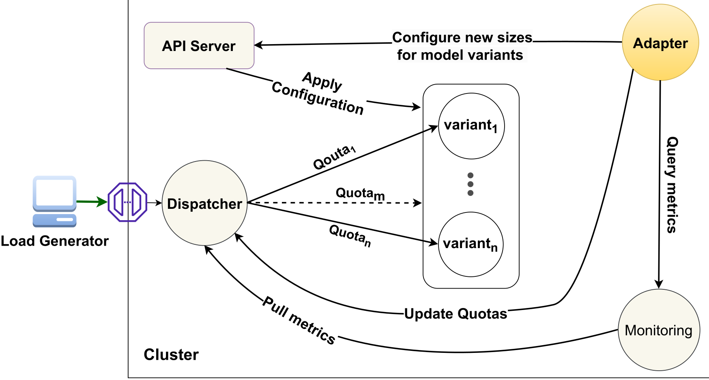
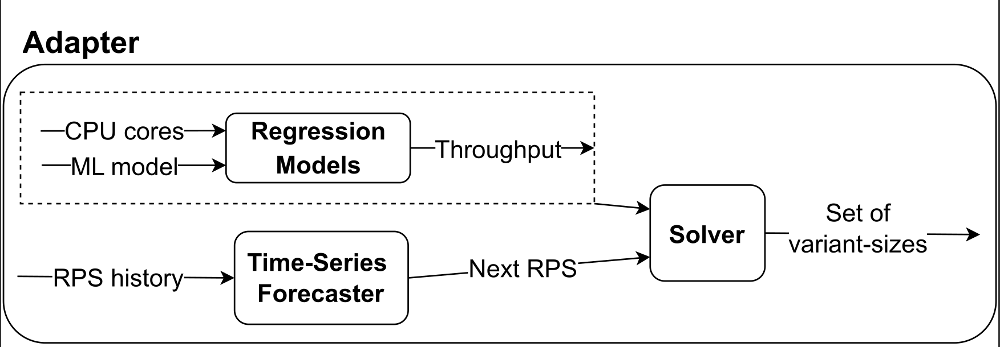

*InfAdapter: An Adaptation Mechanism for ML Inference Services*
-

## Instructions
1. Create a Kubernetes cluster

2. Set up Prometheus monitoring inside the cluster

3. Create a namespace called mehran: `kubectl create ns mehran`

4. Build resnet models for TensorFlow Serving: instructions at [here](./examples/torch-resnet-kserve/example6/build_models.md)

5. Configure NFS server to keep and serve our models:
insructions at [here](./examples/torch-resnet-kserve/example6/build_nfs_server.md)

6. Export NFS server IP: at your terminal, run:  `export NFS_SERVER=NFS_SERVER_IP` replacing the node's IP address with NFS_SERVER_IP

7. Export a cluster node's IP: `export CLUSTER_NODE_IP=NODE_IP`

    ...

## Technology Stack
- Python
- Kubernetes
- TensorFlow Serving
- Prometheus
